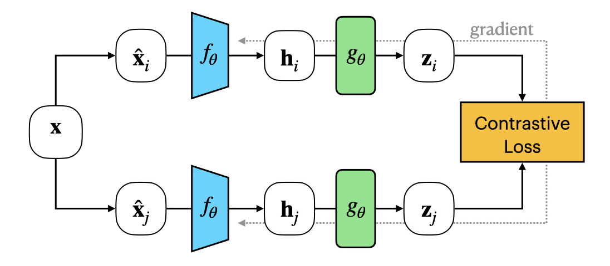

Contrastive Learning
====================

Contrastive Learning (CL) is a family of methods that aims at learning robust general-purpose representations from the data by embedding augmented versions of the same sample close to each other while trying to push away representations from different samples. This goal is achieved either by learning to discriminate between similar (positives) and dissimilar (negative) samples, or by maximizing only the agreement between pairs of similar views. Data augmentation is the core of contrastive learning. Positive and negative samples are generated by applying a set of transformations to the original sample (e.g., noise addition, scaling, permutation, horizontal or vertical flip). These transformation aim at introducing some differences while at the same time preserving the data global features. Contrastive learning has gained enormous attention due to its simplicity and effectiveness in training general-purpose encoders. For this reason, a large variety of approaches can be found in the literature, usually employing siamese architectures (weight-sharing neural networks applied on two or more inputs) to compare the augmented samples.

  Scheme of the SimCLR Contrastive Learning algorithm

Many contrastive learning alorithm has been proposed in the last few years. Here are reported those already employed in EEG data analysis

- `[SimCLR, 2020] <https://arxiv.org/abs/2002.05709>`_
- `[MoCo, 2019] <https://arxiv.org/abs/1911.05722>`_
- `[BYOL, 2020] <https://arxiv.org/abs/2006.07733>`_
- `[Barlow Twins, 2021] <https://arxiv.org/abs/2103.03230>`_
- `[SimSiam, 2021] <https://arxiv.org/abs/2011.10566>`_
- `[VICReg, 2022] <https://arxiv.org/abs/2105.04906>`_
- `[DINO, 2021] <https://arxiv.org/abs/2104.14294>`_

