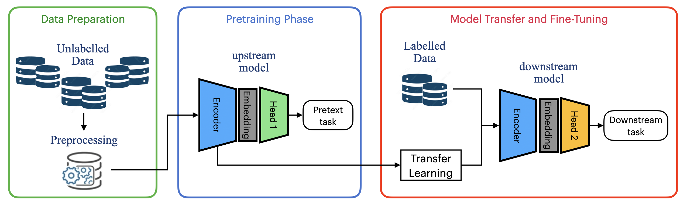

Self-Supervised Learning
========================

Self-Supervised Learning (SSL) is a deep learning paradigm that attempts to address the problem of having a limited amount of annotated data by extracting general-purpose features from vast unlabelled data. Its goal, in contrast with other unsupervised methods like clustering or Principal Component Analysis, is not to try discover redundancies in the data or cluster them into groups, but rather predict part of its input from other parts of its input in order. In other words, self-supervised learning aims at converting the unsupervised problem into a supervised one (hence its name) by generating its own form of supervision directly from the data; hence, it can use way more supervisory signals than standard fully supervised approaches. That’s why it is more proper and less misleading to allocate SSL algorithms in a separate category rather than trying to associate them with other unsupervised methods.

The following figure represents a typical self-supervised learning pipeline

  Scheme of a self-supervised learning pypeline

First, a deep neural network is trained to solve an auxiliary task, also called pretext task, whose primary goal is to learn general-purpose features of the given data without having access to any type of external supervision. Although pretraining strategies can highly differ from each other, this phase usually includes the generation of artificially created pseudo-labels from the unlabeled dataset, here used as the target variable. Training samples are then fed to the model in order to predict the constructed target; then, model predictions are used to calculate the value of a given objective function, which is then used to update the model weights with backpropagation. 

Once the model is pretrained, the weights of the encoder are transferred to a new model, which will be trained to solve the target task, usually called downstream task. The new model shares the same backbone structure, while its head is adapted to the scope of the target task, for example by adding a softmax or a regression layer in case of classification or regression problems, respectively. Model transfer is performed by applying transfer learning, a method that consists of employing the knowledge that has been learnt in a source task (here the pretext task) to another target task (here the downstream task) in order to improve the performance and generalization capability of the new model.

The final step consists of learning more task-specific features using the limited amount of labeled data in a process called fine-tuning. The fine-tuning phase shares many similarities with a standard fully supervised training procedure with the main difference residing in the initialization of the model weights, which originated from the solved pretext task rather than being randomly initialized.

In conclusion, self-supervised learning, although more complex than a standard fully supervised procedures, demonstrated to improve accuracy and mitigate overfitting in contexts where the amount of labeled data is limited or where multiple heterogeneous datasets can be aggregated.

