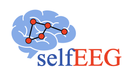

.. toctree::
   :maxdepth: 2
   :caption: About Self-Supervised Learning
   :hidden:

   Self-Supervised Learning <SelfSupervisedLearning>
   Contrastive Learning <Contrastive>

.. toctree::
   :maxdepth: 1
   :caption: Tutorials
   :hidden:

   Dataload_guide
   Augmentation_guide
   SSL_guide

.. toctree::
   :maxdepth: 2
   :caption: API
   :hidden:

   selfeeg

.. toctree::
   :maxdepth: 2
   :caption: about
   :hidden:

   FAQ <faq>
   GitHub Page <https://github.com/MedMaxLab/selfEEG>
   Bug Tracker <https://github.com/MedMaxLab/selfEEG/issues>
   CONTRIBUTING
   License <https://github.com/MedMaxLab/selfEEG/blob/main/LICENSE.md>
   MedMax Team <https://sites.google.com/view/medmaxproject/home>

What is selfEEG?
================

selfEEG is a PyTorch-based library designed to support Self-Supervised Learning (SSL) on EEG data. In selfEEG, you can find different functions and classes which help you build an SSL pipeline, from the creation of the dataloaders, to the model's fine-tuning, passing through the design of custom data augmenters, models, and pretraining strategies.
SelfEEG comprises the following modules:

1. **dataloading**, where you can find a collection of functions and classes designed to support data splitting and the construction of efficient PyTorch dataloaders.
2. **augmentation**, where you can find lots of already implemented data augmentations with full GPU support, as well asother classes designed to combine them in more complex patterns
3. **models**, where you can find lots of already implemented models widely used in EEG analysis (DeepConvNet, EEGNet, ResNet, TinySleepNet, STNet, etc. )
4. **ssl**, where you can find already implemented self-supervised learning algorhitms (e.g. SimCLR, SimSiam, MoCo, BYOL, etc) with a highly customizable fit method as well as a function for fine-tuning.
5. **losses**, where you can find the implementation of the SSL losses.
6. **utils**, where you can find a collection of utility functions and classes for various purposes, such as a PyTorch compatible EEG sampler and scaler.

What makes selfEEG good? We have designed some modules keeping in mind EEG applications, but lots of functionalities can be easily exported on other types of signal data often coupled with EEG data!

What you will not (currently) find in selfEEG? In selfEEG you will not find functions to effectively preprocess EEG data (although filtering and resampling can be performed with some of our functions).
If you want to preprocess EEG data in a really good way, take a look at:

- **MNE** (python based)
- **EEGLAB** (matlab based)
- **BIDSAlign** (an EEGLab extension provided by our team)

Getting Started
===============    

About Self-Supervised Learning
------------------------------
If you are new to the concept of self-supervised learning, we suggest taking a look at the following content, which provided a brief introduction to the **self-supervised learning** paradigm and the family of **contrastive learning** pretext task.

:doc:`SelfSupervisedLearning`

:doc:`Contrastive`

Installation
------------
SelfEEG can be installed via pip::
    
    pip install selfeeg

Additionally, optinal but useful packages which we suggest to include in your environment, especially if you plan to work with jupyter, can be automatically installed with the following pip command::
    
    pip install selfeeg[interactive]

Dependencies
------------
selfEEG requires the following packages to correctly work. If you want to use selfEEG by forking and cloning the project, be sure to install them:

- pandas
- scipy 
- torch >= 2.0.0
- torchaudio >=2.0.2
- torchvision >=0.15.2
- tqdm

The following list was extracted via ``pipdeptree`` (`github repo
<https://github.com/tox-dev/pipdeptree/tree/main>`_). Packages like ``numpy`` does not appear because they are dependencies of other listed packages.

Optional packages which we suggest to include in your environment are listed as follows:

- jupyterlab
- scikit-learn
- seaborn (or simply matplotlib)
- MNE

Tutorial Notebooks
==================

The following notebook-style pages include a detailed guide on how to use some library functionalities that we believe require further explanation in addition to the examples provided in the documentation API.

:doc:`Dataload_guide`
   learn how to use the dataloading module for creating PyTorch dataloaders 

:doc:`Augmentation_guide`
   learn how to combine different data augmentations to construct custom augmenters

:doc:`SSL_guide`
   learn how to build a self-supervised learning pipeline.

API
===

.. list-table:: SelfEEG
   :widths: 15 50
   :header-rows: 1

   * - Modules
     - Functionalities
   * - :doc:`dataloading <selfeeg.dataloading>`
     - - Split data according to the experimental setting
       - Create custom Datasets and Samplers to give to the Dataloader
   * - :doc:`augmentation <selfeeg.augmentation>`
     - - Implementation of several data augmentations
       - Combine different data augmentations
   * - :doc:`models <selfeeg.models>`
     - - Implementation of several Deep Learning Models
   * - :doc:`models <selfeeg.losses>`
     - - Implementation of Contrastive Losses
   * - :doc:`ssl <selfeeg.ssl>`
     - - Implementation of SSL algorithms
       - already implemented fine-tuning function
   * - :doc:`utils <selfeeg.utils>`
     - - Implementations of various utility functions

About
=====

Contribution Guidelines
-----------------------
If you'd like to **contribute** to selfEEG, please take a look at our contributing guidelines.

:doc:`CONTRIBUTING`

If you also have **suggestions** regarding novel features to add, or simply want some **support** on how to exploit this library in your SSL experiments, please consider writing to our research team.

`MedMax Team <mailto:manfredo.atzori@unipd.it,federico.delpup@studenti.unipd.it,andrea.zanola@studenti.unipd.it,louisfabrice.tshimanga@unipd.it>`_

We are really open to new collaborations!

Requests and bug tracker
------------------------
If you have some requests or you have noticed some bugs, use the `Issue
<https://github.com/MedMaxLab/selfEEG/issues>`_ page to report them. We will try to solve reported bugs as fast as possible.

Authors and Citation
--------------------
We have worked really hard to develop this library. If you use selfEEG during your research, please cite our work. It will help us to continue doing our research.

Contributors:

- Eng.  Federico Del Pup
- M.Sc. Andrea Zanola
- M.Sc. Louis Fabrice Tshimanga 
- Eng.  Paolo Emilio Mazzon
- Prof. Manfredo Atzori

License
-------
see `MIT License
<https://github.com/MedMaxLab/selfEEG/blob/main/LICENSE.md>`_